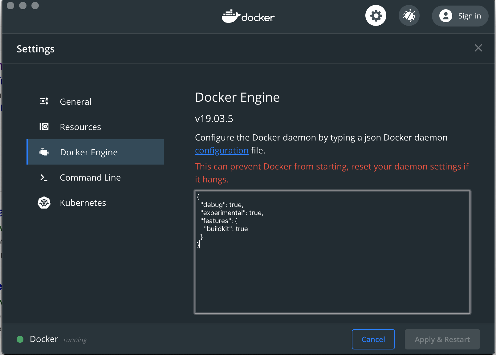

# Nightclazz Kubernetes Development/Deployment tools

## Plan

- Présentation générale de la Nightclazz
- Mise en place des pré-requis
- Étapes
  - Mise en place de l'intégration continue (construire l'image de conteneur)
  - Déploiement d'une application en dev via descripteurs
  - Déploiement de l'application en dev via kustomize
  - Déploiement de l'application en prod via kustomize
  - (Optionnel) Déploiement de l'application en local via helm template
  - Mise en place de skaffold pour déployer avec live-reload sur la dev
- Annexe/Outils
  - kind
  - k3s/k3d
  - kustomize
  - skaffold
- Astuces

## Présentation générale

L'objectif de cette Nightclazz est de se familiariser avec quelques outils de
la galaxie Kubernetes qui permettent :

- De simplifier les déploiement
- D'utiliser Kubernetes au plus tôt et d'en simplifier l'usage
- De profiter de fonctions de live-reload dès le développement

## Mise en place des pré-requis

Pour commencer, vous pouvez cloner le repository [https://github.com/Zenika/nc-kubernetes-dev-tools](https://github.com/Zenika/nc-kubernetes-dev-tools)
Celui-ci contient les éléments nécessaires et l'application que nous allons déployer sur Kubernetes.

Ensuite connectez-vous sur le gitlab suivant : [https://gitlab.pyaillet.tech/](https://gitlab.pyaillet.tech/) en utilisant les informations de connexion qui vous serons communiquées.

Sur cette instance gitlab, vous devez avoir accès à un espace (group) permettant de stocker et gérer vos projets.
Pour pouvoir envoyer pousser votre code sur ce gitlab, il sera nécessaire d'y ajouter une clé ssh.
Vous pouvez vous référer à la [documentation officielle de gitlab](https://docs.gitlab.com/ee/ssh/) si vous ne savez pas comment procéder, demander l'aide des animateurs ou d'un autre participant.

Il faudra ensuite créer un projet `app`, faites attention à bien le créer dans le group qui vous est affecté car celui-ci contient les variables permettant de se connecter et déployer sur le cluster Kubernetes. Pour vous en assurer consultez l'onglet `Groups` > `Your groups`. Dans votre group allez dans `settings` > `CI / CD`, dépliez la section `Variables`. Celle-ci doit contenir 2 variables `KUBECONFIG_DEV`et `KUBECONFIG_PROD` qui contiennent les informations permettant de se connecter à un cluster [GKE](https://cloud.google.com/kubernetes-engine/?hl=fr) et d'y déployer l'application.

Une fois le projet créé :

- Clonez-le dans un répertoire sur votre ordinateur
- Copiez le contenu du répertoire `app` du projet [https://github.com/Zenika/nc-kubernetes-dev-tools](https://github.com/Zenika/nc-kubernetes-dev-tools) dans ce répertoire et assurez-vous de pouvoir pousser vos modifications sur gitlab.

Félicitations ! La mise en place est terminée.

## Étapes

L'application exemple est une application ultra-minimaliste. L'objectif n'est pas de s'attarder sur le code de l'application mais de se concentrer sur les aspects suivants :

- construction d'une image en intégration continue
- déploiement automatisée de l'application sur différents environnements
- gestion des différences de configuration entre les environnements

Les étapes suivantes doivent vous permettre de déployer votre projet sur kubernetes en utilisant des pipelines de type gitops.
Pour vous faire une idée plus précise de l'objectif, vous pouvez consulter les `docker-compose` exemples qui donnent un aperçu de l'application déployée dans un environnement "dev" et dans un environnement "prod".

### Mise en place de l'intégration continue

La première étape consiste à construire l'image Docker de l'application en utilisant `gitlab-ci`.
Malheureusement, l'instance gitlab utilise un runner déployé sur gke sans privilège ce qui ne permet pas de construire les images en utilisant simplement [Docker in Docker](https://docs.gitlab.com/ee/ci/docker/using_docker_build.html#use-docker-in-docker-workflow-with-docker-executor).

Il sera donc nécessaire d'utiliser un autre outil qui permet de construire des images de conteneur sans être en mode privilégié.
Cette [présentation] donne une assez bonne idée de la diversité de ces outils et de bons pointeurs pour les comparer.
Ce qu'il faut en retenir, est que par défaut la construction d'images Docker en utilisant Docker nécessite un niveau de privilège élevé ce qui n'est pas forcément une bonne idée.

Dans notre cas, nous nous concentrerons sur [kaniko](https://github.com/GoogleContainerTools/kaniko).
La [documentation officielle de gitlab](https://docs.gitlab.com/ee/ci/docker/using_kaniko.html) indique comment intégrer un build et un push d'image Docker sur gitlab-ci en utilisant kaniko.

Utilisez cette documentation pour mettre en place la construction sur votre projet.

### Déploiement d'une application en dev via descripteurs

Une fois la construction de l'image Docker réalisée, il faut maintenant déployer l'application sur Kubernetes.
Afin de faire en sorte que l'application soit déployée et utilisable, il sera nécessaire de créer 4 descripteurs :

- 1 descripteur de [déploiement](https://kubernetes.io/docs/concepts/workloads/controllers/deployment/#creating-a-deployment)
- 1 descripteur de [service](https://kubernetes.io/docs/concepts/services-networking/service/#defining-a-service)
- 1 descripteur de [configmap](https://kubernetes.io/docs/tasks/configure-pod-container/configure-pod-configmap/#create-configmaps-from-directories) comprenant les fichiers de configurations en environnment de dev
- 1 descripteur d'ingress, regardez l'exemple ci-après. L'ingress controller [traefik](https://docs.traefik.io/) est déjà déployé sur le cluster)

Pour l'ingress à utiliser inspirez-vous de l'exemple suivant :

```yaml
apiVersion: extensions/v1beta1
kind: Ingress
metadata:
  name: base
  annotations:
    kubernetes.io/ingress.class: traefik
spec:
  rules:
  - host: CHANGE_ME.35.234.90.180.xip.io
    http:
      paths:
      - backend:
          serviceName: base
          servicePort: 8080
```

Modifiez CHANGE_ME pour qu'il corresponde au modèle suivant : <USER>_<NAMESPACE>.

Une fois ces descripteurs réalisés, déployez l'application en modifiant le fichier `.gitlab-ci.yml` afin :

- d'ajouter la commande `kubectl`
- de préciser le kubeconfig utilisé issu des variables du group gitlab (choisir KUBECONFIG_DEV)
- de préciser le namespace de destination directement via `kubectl`

Une fois l'application déployée, vous devez pouvoir consulter le résultat en ouvrant dans votre navigateur l'adresse déclarée dans l'ingress : [http://CHANGE_ME.35.234.90.180.xip.io](http://CHANGE_ME.35.234.90.180.xip.io)

### Outils k9s / kubens / kubectx

Afin de s'assurer que tout fonctionne correctement, il est nécessaire de se connecter au cluster et de vérifier le statut des différentes ressources.
Pour cela, récupérer le contenu de la variable KUBECONFIG_DEV et copier le dans le fichier `~/.kube/config-dev` sur votre machine.
Il est possible d'utiliser la commande `kubectl` avec la variable d'environnement KUBECONFIG=~/.kube/config-dev.
Afin de simplifier les manipulations, vous pouvez utiliser les outils [kubectx/kubens](https://github.com/ahmetb/kubectx) qui permettent de changer facilement le `namespace` ou le contexte kubernetes vers lequel vous pointez.
Il est également possible de changer carrément le `kubeconfig` que vous utilisez : https://github.com/pyaillet/dotfiles/blob/master/.zshrc.d/080_switch_kubeconfig

[K9s](https://github.com/derailed/k9s) est un autre outil qui simplifie grandement le déboguage sur Kubernetes.
Il se présente comme un dashboard kubernetes utilisable dans un terminal ayant l'avantage de fournir des raccourcis clavier très efficaces.
Il est installable très facilement en téléchargeant le binaire pour votre OS (voir la section Assets de chaque release).

Si vous rencontrez des problèmes, n'hésitez pas à faire un appel à un animateur, à un autre participant ou à consulter [ce guide](https://learnk8s.io/troubleshooting-deployments) qui fournit une procédure pour identifier les problèmes lorsqu'un déploiement sur Kubernetes est en échec.

### Déploiement de l'application en dev/prod via kustomize

Le mode de déploiement que nous avons vu n'est pas idéal :

- La configuration est partiellement identique entre l'environnement prod et dev, mais partiellement différente
- Les ingress sont partiellement différents entre les environnements
- Les déploiements et services sont identiques au namespaces près

L'outil [kustomize](https://github.com/kubernetes-sigs/kustomize) propose de réaliser des déploiements sur Kubernetes en composant les différents descripteurs et leur configuration.

Son fonctionnement est finalement assez simple :

- Une kustomization est un répertoire contenant un fichier descripteur `kustomization.yaml`.
- Ce fichier référence des ressources Kubernetes, les informations permettant de créer des configmaps, d'ajouter des metadonnées aux ressources Kubernetes
- Il est possible de distinguer :
  - une `kustomization` de base qui est commune aux différents environnements
  - des `overlays` qui viennent compléter et/ou surcharger une partie de la base

Une fois les descripteurs écrits, il est possible de les déployer :

- soit en produisant les descripteurs avec la commande `kustomize` et en les déployant avec `kubectl`
- soit directement avec `kubectl` en utilisant le flag `-k`
- il est également possible de pré-visualiser ce qui sera déployé avec `kubectl` avec la commande suivante : `kubectl apply -k overlays/dev --dry-run -o yaml`

L'objectif de cette étape est donc d'écrire la base et les overlays kustomize pour les environnements dev et prod.

Petit indice :

- la base référencera :
  - la configuration commune, générée avec un [configMapGenerator](https://github.com/kubernetes-sigs/kustomize/blob/master/examples/configGeneration.md)
  - le déploiement
  - le service
- les overlays référenceront :
  - la config spécifique [en mergeant une clé supplémentaire](https://github.com/kubernetes-sigs/kustomize/blob/master/examples/combineConfigs.md#create-and-use-the-overlay-for-production) à la configmap générée par la base
  - l'ingress

Une fois ces descripteurs créés, déployez l'application sur le cluster en modifiant le fichier `.gitlab-ci.yml` afin d'ajouter la commande de déploiement : `kubectl --kubeconfig $KUBECONFIG_DEV apply -k kustomize/overlays/dev`

### Mise en place de skaffold pour déployer avec live-reload sur la dev

### Skaffold

### K3d

## Solutions

Les solutions sont disponibles sur le repository sur la branche [app/solutions](https://github.com/Zenika/nc-kubernetes-dev-tools/tree/app/solutions).

## Astuces/Bonne pratiques

- Utilisez [buildkit](https://github.com/moby/buildkit)



- Utilisez .dockerignore
- N'utilisez pas de tag `latest`
- **Si ce n'est pas sur git, ça n'existe pas**
